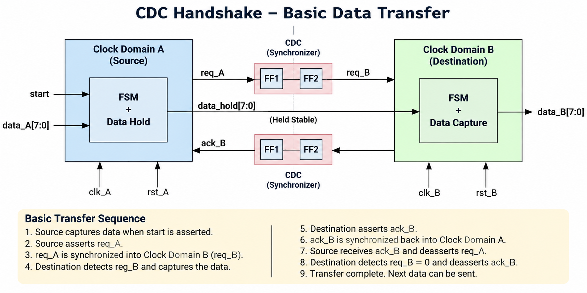

# CDC Handshake using Verilog

## Overview

Clock Domain Crossing (CDC) is required when data or control signals need to be transferred between two different clock domains.

This project implements a **request/acknowledge handshake-based CDC mechanism** to transfer 8-bit data from a source clock domain (Clock A) to a destination clock domain (Clock B).

The design uses synchronized request and acknowledge signals to coordinate the data transfer between the two asynchronous clock domains.

## Architecture



## What is CDC Handshake?

A CDC handshake uses two control signals:

- **Request (`req`)** – indicates that new data is available.
- **Acknowledge (`ack`)** – indicates that the destination has received the request and captured the data.

```text

SOURCE (CLK_A)                  DESTINATION (CLK_B)

   Data_A
     |
     v
[Hold Data]
     |
     v
  req_A = 1
     |
     |---------> Synchronize --------->|
                                      |
                                      v
                               [Capture Data]
                                      |
                                      v
                                  ack_B = 1
                                      |
     |<--------- Synchronize ---------|
     |
     v
  req_A = 0
     |
     |---------> Synchronize --------->|
                                      |
                                      v
                                  ack_B = 0
                                      |
     |<--------- Synchronize ---------|
     |
     v
 Transfer Complete

 ```

## CDC Synchronization

Since `req_A` and `ack_B` cross between asynchronous clock domains, they are passed through **two flip-flop synchronizers**.

```text
Clock A                         Clock B

req_A ───────────────► FF1 ──► FF2 ──► FSM

ack_B ◄─────────────── FF1 ◄── FF2 ◄── FSM
```

The two-stage synchronizers help reduce the risk of metastability propagating into the receiving logic.

## RTL Design

The design consists of source-domain and destination-domain logic.

### Source Domain

The source module:

- Operates using `clk_A`
- Captures input data into `data_hold`
- Generates the request signal `req_A`
- Synchronizes `ack_B` into Clock A
- Uses an FSM to control the handshake

### Destination Domain

The destination module:

- Operates using `clk_B`
- Synchronizes `req_A` into Clock B
- Detects the synchronized request
- Captures the data from `data_hold`
- Generates the acknowledge signal `ack_B`

### Top Module

The top module connects the source and destination clock domains and provides the interface for the complete CDC handshake.

## FSM Operation

### Source FSM

```text
IDLE → SEND → DONE → IDLE
```

- **IDLE:** Waits for `start`
- **SEND:** Holds `req_A` high until `ack_B` is received
- **DONE:** Waits for `ack_B` to return low before starting another transfer

### Destination FSM

```text
IDLE → CAPTURE → ACK → IDLE
```

- **IDLE:** Waits for synchronized request
- **CAPTURE:** Captures the transferred data
- **ACK:** Holds `ack_B` high until the request is removed

## Data Transfer

The source captures the input data in `data_hold` before asserting `req_A`.

The source keeps `data_hold` stable during the handshake. The destination detects the synchronized request and captures the stable data.

```text
data_A
  |
  v
data_hold ───────────────────────► data_B
             Held Stable

req_A ──► Synchronizer ──► Destination
ack_B ◄── Synchronizer ◄── Destination
```

## Features

- Two asynchronous clock domains
- Request/acknowledge handshake
- Two-stage synchronizers
- 8-bit data transfer
- Source-side data holding register
- FSM-based control
- Independent source and destination clocks
- Reset support

## Verification

The testbench uses two independent clocks:

- Clock A: **10 ns period**
- Clock B: **14 ns period**

The testbench verifies the transfer of 8-bit data from Clock A to Clock B and allows sufficient time for the complete request/acknowledge handshake.


## Tools Used

- Verilog HDL
- Xilinx Vivado
- Vivado Simulator

## Concepts Used

- Clock Domain Crossing (CDC)
- Request/Acknowledge Handshake
- Metastability
- Two-Flip-Flop Synchronizer
- Asynchronous Clock Domains
- FSM Design
- Data Holding Register
- RTL Design
- Sequential Logic

## Author

**Niharika Naik**
